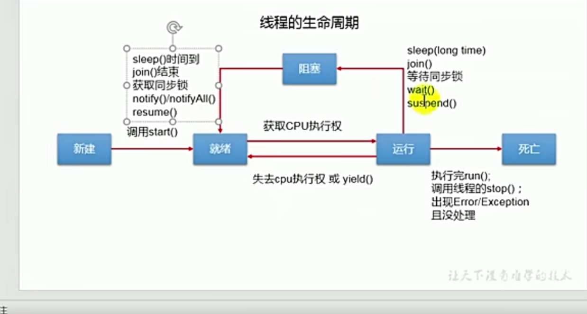

###程序、进程、线程
程序：一段静态的代码；
进程：正在执行的程序；生命周期 产生、存在、消亡。
线程：一个进程包含多个线程。是一个程序内部的一条执行路径。

####CPU与线程
CPU在一个时间单元内只能执行一个线程，但是可以上下文切换，当前线程没有执行完，可以开始另一个线程的执行。

###单核CPU有必要多线程吗？https://www.cnblogs.com/chsoul/p/12650238.html
即便是单核CPU，一个进程中往往也是有多个线程存在的，每个线程各司其职，CPU来调度各线程。
```
线程总耗时：数据库连接耗时 + 磁盘文件读取耗时
多线程总耗时：约等于耗时最长的那个时间
```
###继承Thread 和实现Runnable 接口两种创建线程的方式
优先使用Runable
原因：1.实现的方式没有类的单继承的局限性
      2.实现的方式更适合来处理多个线程有共享数据的情况。
Thread 类其实也是实现的runnable
两种方式都需要重写run(),将线程要执行的逻辑声明在run()中。


###线程的生命周期
新建-new Thread（）；  
就绪-调用start();  
运行  
阻塞  
死亡




###  Java多线程synchronized/Lock锁
~~~~
1.sync是java关键字，属于jvm层面，底层实现是monitor；
  lock是一个类，api层面的锁；
  synchronized 可以修饰静态方法、实例方法、代码块；
  synchronized关键字加到static静态方法和synchronized(class)代码块,上都是是给Class类上锁，
  而synchronized关键字加到非static静态方法上是给对象上锁。
  Lock 实现的锁只能修饰代码块.
2.sync不需要手动释放锁，系统会自动让线程释放锁的占用；
  ReentrantLock需要手动释放锁，要不然会造成死锁；需要lock()和UnLock()方法配合try/finally语句来完成。
3.sync不可以中断，除非抛出异常或者正常运行完成。
 ReentrantLock可以中断:
   a.可以设置超时方法，tryLock(Long timeOut,TimeUnit  unit);
   b.lockInterruptibly()放到代码块中，调用interrupt（）方法中断。
4.sync是非公平锁。即不能保证等待锁的那些线程们的顺序
  renntrantLock 默认都是非公平锁(先等待的线程，先获得锁。)。可以通过构造方法传入boolean实现，true 公平锁，fasle 非公平锁。

5.ReentrantLock可以绑定多个condition，用来实现分组唤醒需要唤醒的线程，即可以精确唤醒。
  sync随机唤醒一个或者全部，notify() notifyAll();
  ~~~~

~~~~
示列出处：https://www.cnblogs.com/mengxinJ/p/13797851.html#_label2_3_3
public class lock2{
   static lock2 ll=new lock2();
   ReentrantLock lock=new ReentrantLock();
   Condition cc=lock.newCondition();

    public static void main(String[] args) {
        new Thread(new qq()).start();
        new Thread(new qq2()).start();
    }
    public static class qq implements Runnable{

        @Override
        public void run() {
            ll.aa();
        }

    }
    public static class qq2 implements Runnable{

        @Override
        public void run() {
            ll.bb();
        }

    }

    public void aa() {
        lock.lock();
        try {
            System.out.println("aa方法开始了"+Thread.currentThread().getName());
            Thread.sleep(2000);
            cc.await();
            System.out.println("aa方法结束了"+Thread.currentThread().getName());
        } catch (InterruptedException e) {
            e.printStackTrace();
        }finally {
            lock.unlock();
        }
    }
    public void bb() {
        lock.lock();
        try {
            System.out.println("bb方法开始了"+Thread.currentThread().getName());
            Thread.sleep(2000);
            System.out.println("bb方法结束了"+Thread.currentThread().getName());
            cc.signal();
        } catch (InterruptedException e) {
            e.printStackTrace();
        }finally {
            lock.unlock();
        }
    }

}
~~~~
